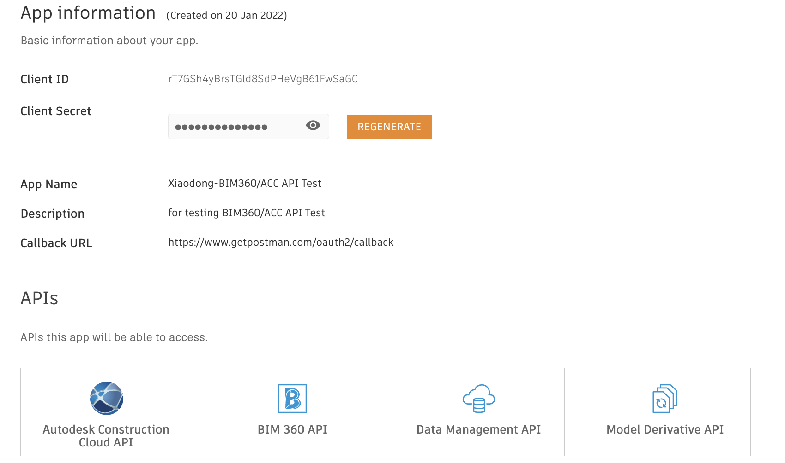
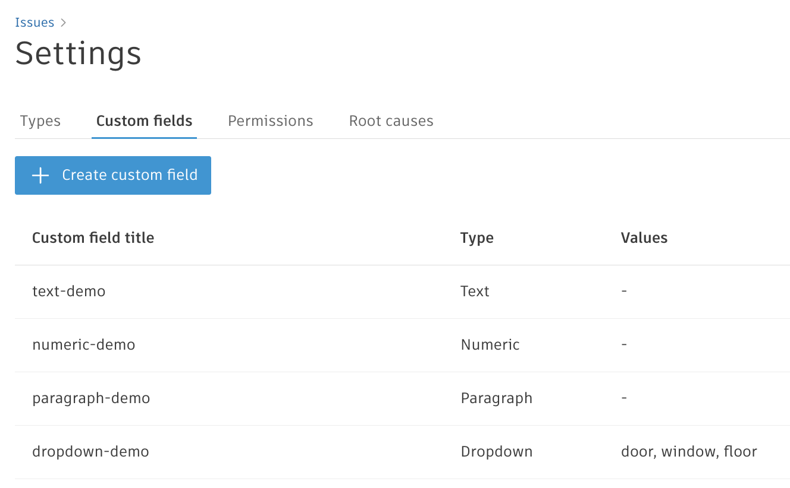
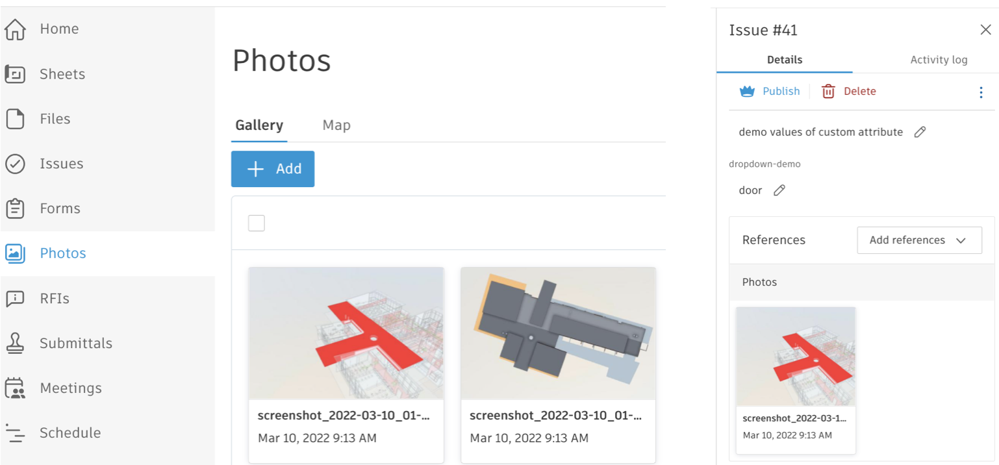
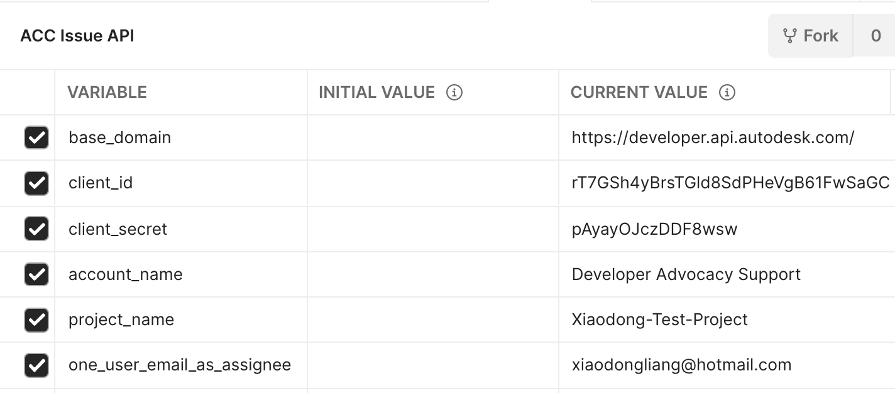
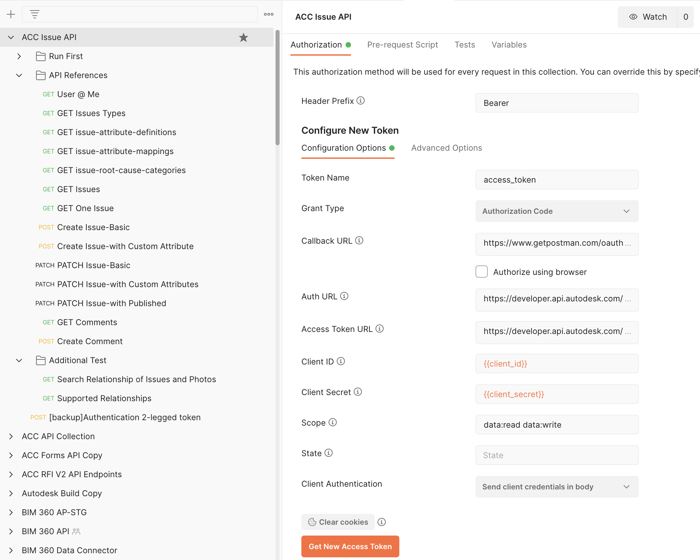
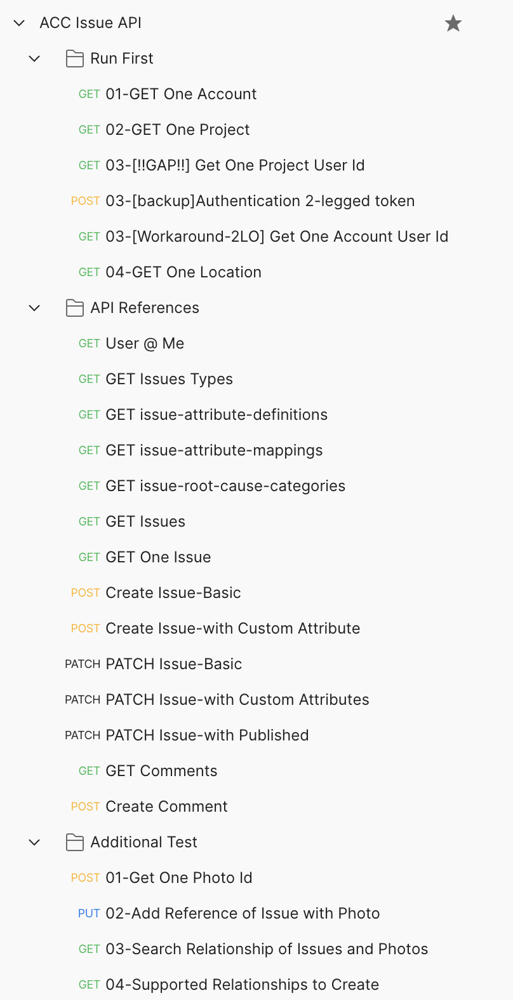

# Postman Collection for ACC Issues API 

[](https://www.getpostman.com/)

[](https://forge.autodesk.com/en/docs/acc/v1/overview/field-guide/issues/)


[](http://opensource.org/licenses/MIT)

## Description

This repository provides a postman collection that demonstrates the usage of [Issues API for Autodesk Construction Cloud](https://forge.autodesk.com/en/docs/acc/v1/overview/field-guide/issues/)(ACC) .  

The API supports **3 legged token** only.

As of April 15th, 2022, ACC Issues API is **preview beta**. 

## What's Postman?

Postman is a popular tool that provides an easy-to-use interface to send HTTP requests. Postman is able to parse the responses that Forge sends you and save response parameter values to variables. These parameters can then be reused in subsequent requests through these variables. The Postman collections in this repository use this ability to provide pre-populated HTTP requests to help you follow the tutorial workflow with minimal effort. You can also modify the requests and experiment without having to write a single line of code. 

- You can learn how to install and use Postman from [here](https://learning.getpostman.com/docs/postman/launching_postman/installation_and_updates).

- You can download the Postman installer from [here](https://www.getpostman.com/downloads/).


## Setup

1.  **Forge Account**: Learn how to create a Forge Account, activate the subscription and create an app by [this tutorial](http://learnforge.autodesk.io/#/account/). Ensure to select API Type **Autodesk Construction Cloud**. Get Forge _client id_, _client secret_ and  _callback url_. Please register Forge app with the _callback url_ as 

    ```https://www.getpostman.com/oauth2/callback```

   <p align="center"></p>   

2. **ACC Account and project**: must be Account Admin to add the app integration. [Learn about provisioning](https://forge.autodesk.com/blog/bim-360-docs-provisioning-forge-apps). Make a note with the __account name__

3. Follow the [product help document](https://construction.autodesk.com/tools/issues-software/) of ACC to create some issues.

4. Create some custom attributes definitions with all types: text, dropdown, numeric and paragraph. This is to test creating/patching issue with custom attributes.

   <p align="center"></p>   

5. (Optional) Upload a couple of photos in Photo module. This is to test creating reference with Photo.

   <p align="center"></p>   


6.  Clone this repository or download it. It's recommended to install [GitHub Desktop](https://desktop.github.com/). To clone it via command line, use the following (**Terminal** on MacOSX/Linux, **Git Shell** on Windows):

    ```git clone https://github.com/Autodesk-Forge/forge-autodesk.docs.issue.api-postman.collection```

7. Import the collection and environment files to Postman

8. In environment, input _client id_, _client secret_, _account name_, _project name_ and _one user email as assignee_

   <p align="center"></p>  

9. In context menu of collection >> **Edit**, switch to the tab **Authorization**. Click **Get New Access Token**, input the variables as below:

   - Grant Type ``Authorization Code``
   - Callback URL  ``https://www.getpostman.com/oauth2/callback``
   - Auth URL  ``https://developer.api.autodesk.com/authentication/v1/authorize``
   - Access Token URL  ``https://developer.api.autodesk.com/authentication/v1/gettoken``

   - Client ID ``{{client_id}}``
   - Client Secret ``{{client_secret}}``
   - Scope ``data:read data:write``
   - Client Authentication ``Send Client credentials body``

   <p align="center"></p> 
 
 10. Click **Get New Access Token**, it will direct to login Autodesk user account, after it succeeds, the token will be generated. Click **Use Token**.  
   
Issue API requires to work with 3-legged token. This collection takes **[Inheriting auth](https://learning.getpostman.com/docs/postman/sending-api-requests/authorization/#inheriting-auth)** to apply 3-legged token to every endpoint in the collection automatically, which means it does not need to input the token in the header explicitly.

## API Test

1. Assume the steps of **Setup** have been performed and the access token is ready.

2. Run the scripts in **Run First**. It will get account(hub) id, project id and one user id (for assignee when creating a new issue). Because the API to get project users of ACC has not been exposed, we workaround by calling [GET:Account Users](https://forge.autodesk.com/en/docs/acc/v1/reference/http/users-GET/). This endpoint requires 2-legged token, so run _03-[backup]Authentication 2-legged token_ before running _03-[Workaround-2LO] Get One Account User Id_. 

   Next call _04-GET One Location_ to get one location id (for testing issue creation)


3. Run the endpoints in **API References**. Follow [API documents](https://forge.autodesk.com/en/docs/acc/v1/reference/http/issues-users-me-GET/) to verify if the APIs work well. Try to change the parameters in various scenarios to see how it goes. Check UI if it works well with API (such as creating/patching new issue and creating new comments etc. )
    
    <p align="center"></p>   

4. (Optional) In ACC, a reference is defined by Relationships API, which is a common across different modules. To work with **Issue>>References**, you can use [Relationship API](https://forge.autodesk.com/en/docs/acc/v1/reference/http/relationship-service-v2-search-relationships-GET/). This sample Postman collection includes a few sample usages. For more detail about Relationships API, please take a look [at this blog](https://forge.autodesk.com/blog/bim-360acc-relationships-api). 

    *  01-Get id of one photo: call [Photo API](https://forge.autodesk.com/en/docs/acc/v1/reference/http/photos-getfilteredphotos-POST/) to get one photo id
    * 02-Add Reference of Issue with Photo: add reference between one issue (from previous test scripts in #3) and one photo
    * 03-Search Relationship of Issues and Photos: get all referenced photos of one issue
    * 04-Supported Relationships to Create: get all relationships that can be created. Check those which are related with issue. Add more test scripts to create/get relationships of other types of references (document, rfi, asset etc.) 
    
**Blogs**:
- [Forge Blog](https://forge.autodesk.com)
- [Field of View](https://fieldofviewblog.wordpress.com/), a BIM focused blog

## License

This sample is licensed under the terms of the [MIT License](http://opensource.org/licenses/MIT). Please see the [LICENSE](LICENSE) file for full details.

## Written by

Xiaodong Liang [@coldwood](https://twitter.com/coldwood), [Developer Advocate and Support team](http://forge.autodesk.com)